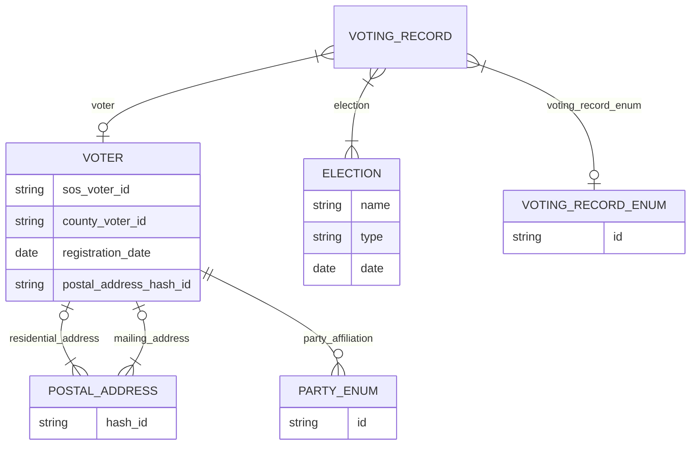

# Normalized data structure

# Optimizations
Although unimplemented in Dataform, optimizations for this data schema should include:
- partitioning the voters dataset by residential address
- clustering voting records by election name
- potentially additional clusterings of postal address if there are particular partitions that are frequently used (precincts?)

# Considerations and extensions

- I've only included some key fields here in the schema; please see the Dataform file and resulting BigQuery tables for a more complete list of fields
- There is potentially a lot more normalization to be done off of the Postal Address table, but this would require a better understanding of competence questions for the datasets.
  - For instance, is it actually helpful for any real-world queries to split apart precincts from the address table? It's definitely a parent data object of an address, but might not be meaningful if not required
