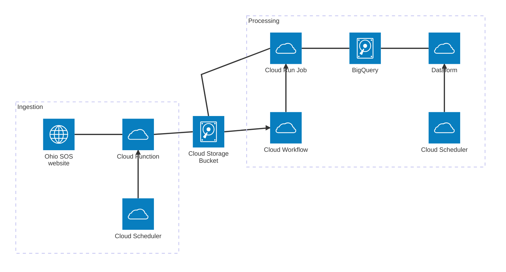

# Ingestion Pipeline

## Overview

The proposed ingestion pipeline provides a combination of unstructured file backups as well as ingest into BigQuery to enable Dataform or dbt processing downstream.

| **Note**: for the sake of completeness, I leave the word `Cloud` in GCP names. Apologies that most words in this document are therefore Cloud.

## Components

There is a sole external resource:

- the ohiosos.gov website, which has static urls and query parameters that can be used to retrieve the latest voter files.

Data is ingested and processed via three sets of services:

- a Cloud Function, triggered by a Cloud Scheduler job.
  - This function has the sole purpose of copying the four major voter files to the Storage Bucket.
  - It does no file transformation, just copies bytes.
  - By reducing logic at this layer, we should always have a copy of the latest voter files, even if we don't know how to process them due to a format change.
  - **NB: I did not prototype this component.**
- a Cloud Run Job, triggered by an EventArc notification and a Cloud Workflow whenever a new file is uploaded to the Storage Bucket.
  - This job has the sole purpose of processing new files and uploading them to a BigQuery table.
  - This can be limited to 1 parallel task at a time to reduce duplicate data runs.
  - This component will use dlt to minimize custom logic that has to be written.
- a Dataform workflow run, triggered by a Cloud Scheduler job.
  - This workflow handles tranformation of the data into usable datasets that meet the requirements of the [PRD](00 PRD.md) and the [Data Structure](01 Data Structure.md).
  - If desired, this can be triggered by the same EventArc workflow upon successful completion of the Cloud Run job, so that data is only processed when new data appears.

The pipeline has two data stores:

- a Storage Bucket, used for storing the raw files as downloaded from the Ohio SOS website, and
- a BigQuery project, used for storing the minimally transformed data to power the dataform pipeline.

## Behavior

Ingest from the website is controlled via the cron-like abilities of Cloud Scheduler. (See Considerations for more on how to add additional behavior.)

Processing from the Cloud Storage Bucket to BigQuery is triggered via EventArc in an event driven fashion. Cloud Workflows and the behavior of the Cloud Run Job influence the delay and parallelism of the job.

Processing from BigQuery raw tables to processed datasets is triggered via a Dataform workflow, which is a Cloud Scheduler job behind-the-scenes.

## Deployment

This project is deployed in a single prototyping environment called ahfc-data-tutorials. I'm happy to give access if desired.

# Considerations and extensions

- The Cloud Function for ingest can be called via a workflow to add more robust retry logic with exponential backoff and alerting, if this proves necessary due to Ohio SOS connectivity issues.
- The Cloud Run Job processing to BigQuery can be made more efficient by adding in the filters that use metadata to detect new files. Right now it can be slow given the CSV file size.
- The data schema is different across the multiple CSV files, and none match the original spec. Additional data cleanup and unification work beyond what I had time for so far will be necessary. In general, dlt is configured to add new columns, so it will mostly be a need to `COALESCE` duplicate columns together (in the simplest cases).
